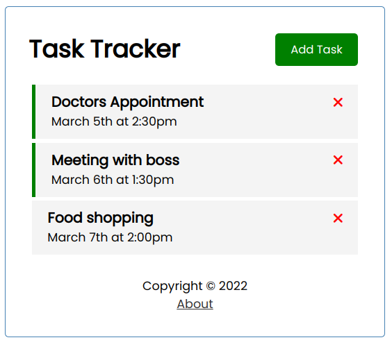
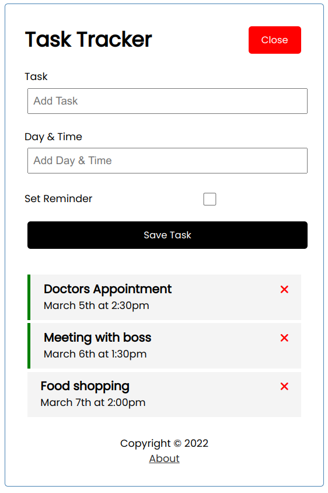
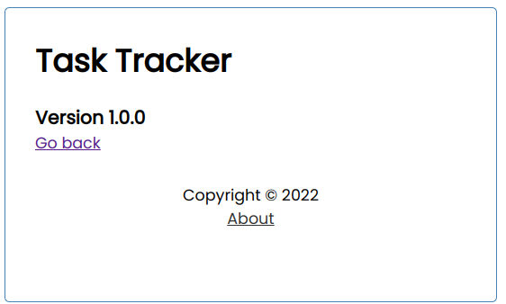

# vue-tasktracker

## Project setup
```
npm install
```

### Compiles and hot-reloads for development
```
npm run serve
```

### Compiles and minifies for production
```
npm run build
```

### Guide








> **Note**
>  Double Click on a Task to toggle the important task! 
### Customize configuration
See [Configuration Reference](https://cli.vuejs.org/config/).
# Todo_Tracker_Vuejs
